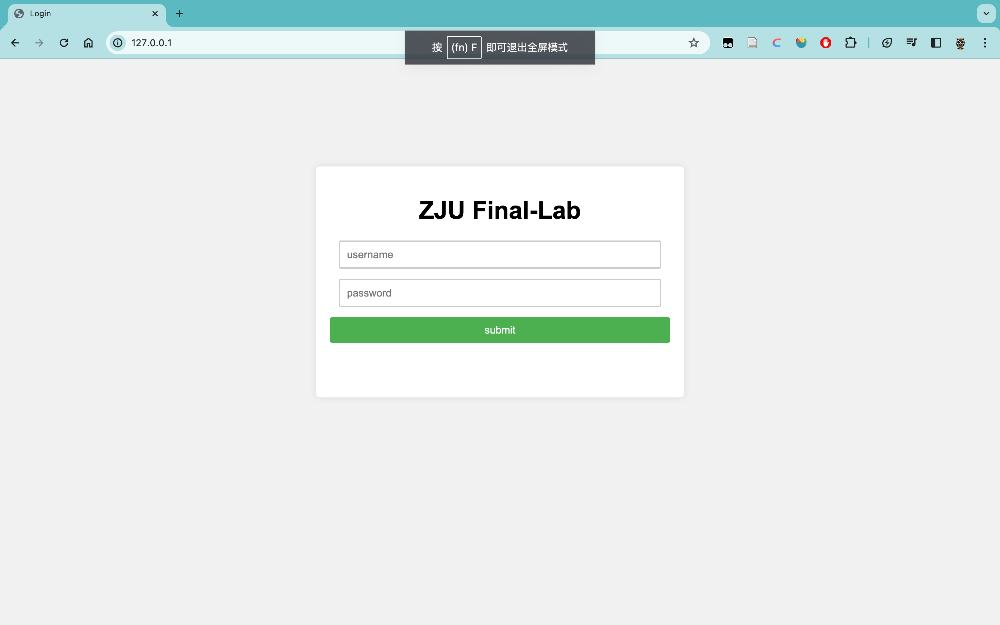
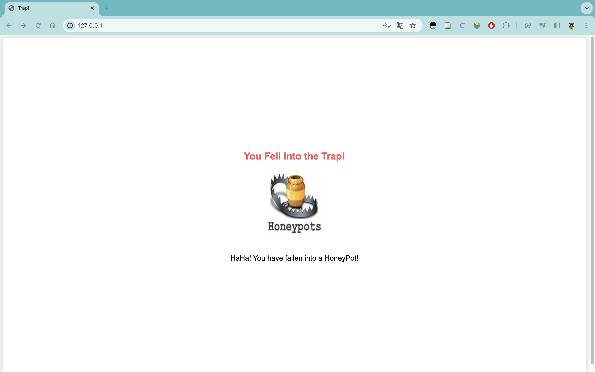

# HoneyPots

## Install

```
> python3 --version
Python 3.8.18

> pip3 install -r requirements.txt
```

## Http Server

- A simple http server that can be used as a honeypot

| login Page | login Success |
| :--------: | :-----------: |
|  |  |

### Usage Example 

#### Quick Start

```
> python3 code/http_server.py
```

#### Custom username, password, ip or port

```
> python3 code/http_server.py --username='zju' --password='zju' --ip='0.0.0.0' --port='80'
```

#### config.json (Output to file and terminal)

```json
{
    "logs": "file, terminal",
    "logs_location": "./log/",
    "honeypots": {
        "http": {
            "port": 80,
            "ip": "127.0.0.1",
            "username": "ez",
            "password": "ez",
            "log_file_name": "http.log",
            "max_bytes": 10000,
            "backup_count": 10
        }
    }
}
```

```
> python3 code/http_server.py --config='config.json'
```

#### Possible Error

```
Couldn't listen on any:80: [Errno 48] Address already in use.
```

- Solution: Change the port number or kill the process that is using the port

```
> lsof -i:80
COMMAND     PID USER   FD   TYPE  DEVICE SIZE/OFF NODE NAME
python3.8 <PID>    *    *   IPv4       *      0t0  TCP *:http (LISTEN)

> kill -9 <PID>
```

## All output values

```sh
'error'     :'Information about current error' 
'server'    :'Server name'
'timestamp' :'Time in ISO'
'action'    :'Query, login, etc..'
'data'      :'More info about the action'
'status'    :'The return status of the action (success or fail)'
'server_ip'   :'Server address'
'server_port' :'Server port'
'attack_ip'    :'Attacker address'
'attack_port'  :'Attacker port'
'username'  :'Attacker username'
'password'  :'Attacker password'
```

## acknowledgment

- This project is based on the work of [honeypots](https://github.com/qeeqbox/honeypots)


